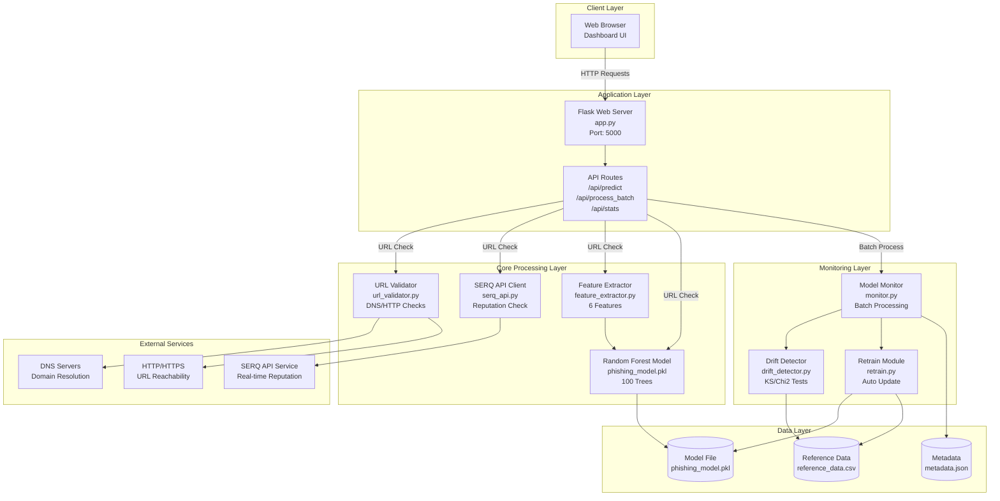
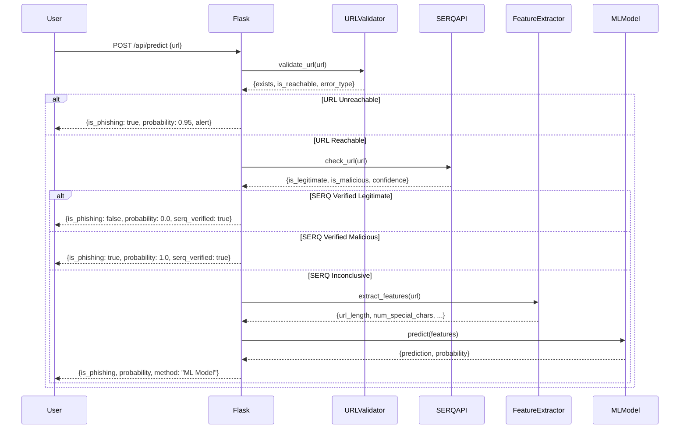
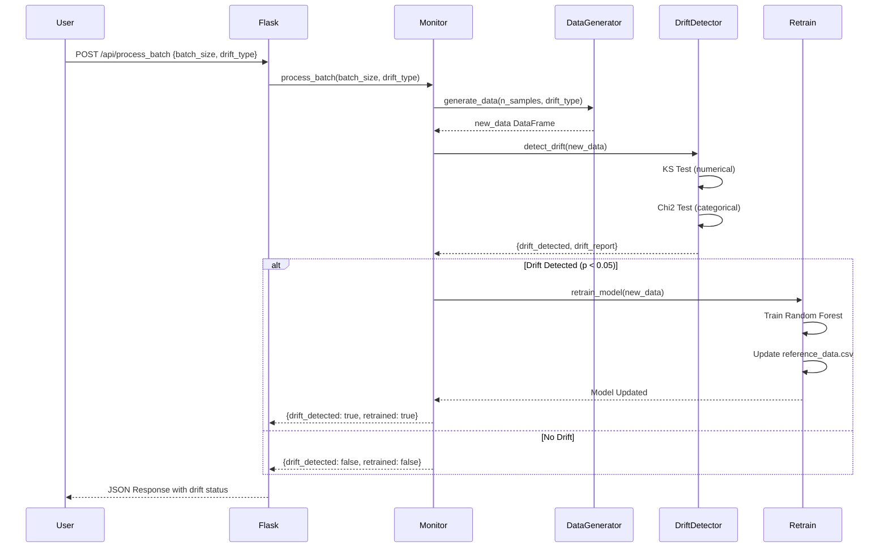
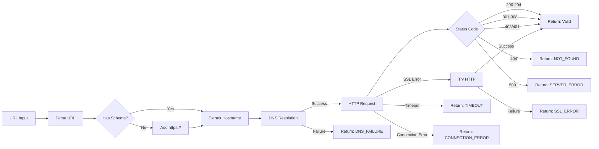
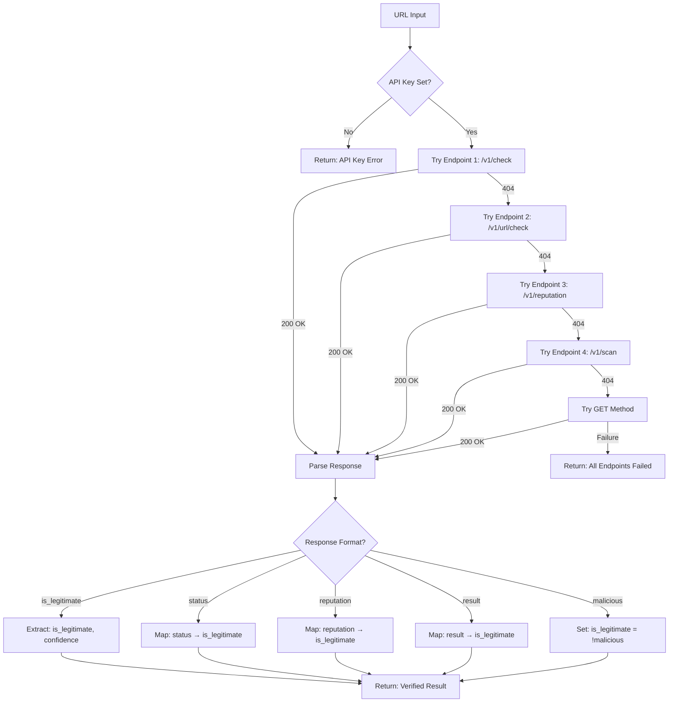
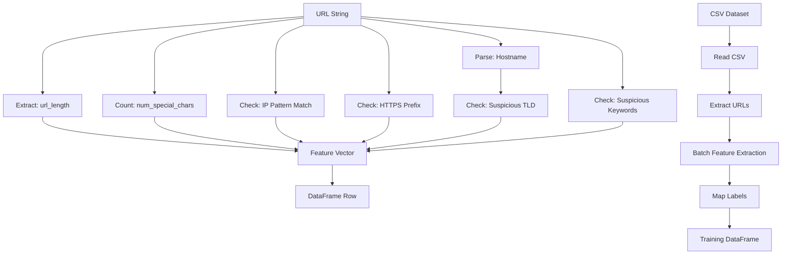
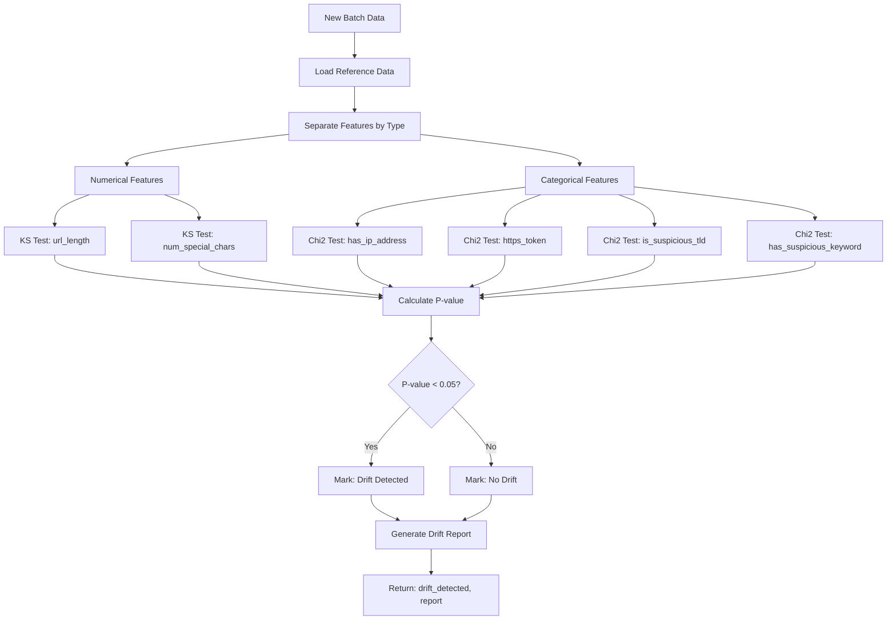
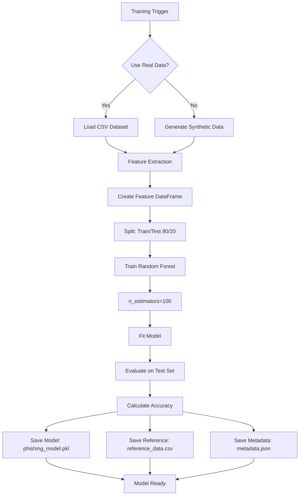
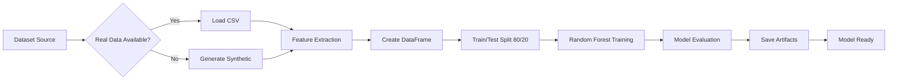
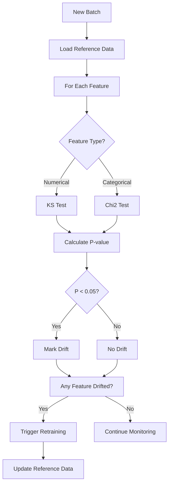

# Phishing URL Detection System - Complete Architecture Documentation

## Table of Contents
1. [System Overview](#system-overview)
2. [Main Architecture Diagram](#main-architecture-diagram)
3. [Component Architecture](#component-architecture)
4. [Data Flow Architecture](#data-flow-architecture)
5. [Mathematical Foundations](#mathematical-foundations)
6. [Sub-System Architectures](#sub-system-architectures)
7. [API Architecture](#api-architecture)
8. [Model Training Architecture](#model-training-architecture)
9. [Drift Detection Architecture](#drift-detection-architecture)

---

## System Overview

The Phishing URL Detection System is a real-time, multi-layered security solution that combines:
- **Machine Learning Classification** (Random Forest)
- **Real-time API Reputation Checking** (SERQ API)
- **URL Validation & Reachability Testing**
- **Automated Model Monitoring & Drift Detection**
- **Web-based Interactive Dashboard**

### Key Features
- **Multi-layered Detection**: URL Validation → SERQ API → ML Model (fallback)
- **Real-time Monitoring**: Continuous drift detection with statistical tests
- **Auto-retraining**: Automatic model updates when drift is detected
- **High Accuracy**: 99.7% test accuracy with hybrid approach

---

## Main Architecture Diagram



---

## Component Architecture

### 1. Web Application Layer (`src/web/app.py`)

**Responsibilities:**
- HTTP request handling
- API endpoint management
- Response formatting
- Error handling

**Key Components:**
- Flask application instance
- Route handlers for `/`, `/api/predict`, `/api/process_batch`, `/api/stats`
- Integration with all core modules

### 2. URL Validation Module (`src/url_validator.py`)

**Responsibilities:**
- DNS resolution checking
- HTTP/HTTPS connectivity validation
- Status code analysis
- SSL certificate verification

**Validation Flow:**
```
URL Input → Parse URL → DNS Check → HTTP Request → Status Analysis → Result
```

**Output:**
- `exists`: Boolean - URL exists
- `is_reachable`: Boolean - URL is reachable
- `status_code`: HTTP status code
- `dns_resolved`: Boolean - DNS resolution success
- `has_ssl`: Boolean - HTTPS available
- `error_type`: Error classification

### 3. SERQ API Client (`src/serq_api.py`)

**Responsibilities:**
- Real-time URL reputation checking
- Multiple endpoint pattern support
- Response parsing (multiple formats)
- Error handling and fallback

**API Flow:**
```
URL → Try Multiple Endpoints → Parse Response → Extract Reputation → Return Result
```

**Supported Response Formats:**
- `{"is_legitimate": true, "confidence": 0.95}`
- `{"status": "safe", "reputation": "good"}`
- `{"malicious": false, "verified": true}`
- `{"result": "legitimate", "score": 0.9}`

### 4. Feature Extraction Module (`src/feature_extractor.py`)

**Responsibilities:**
- URL feature extraction
- Dataset processing
- Feature normalization

**Extracted Features (6 total):**
1. `url_length`: Integer - Total URL character count
2. `num_special_chars`: Integer - Count of special characters (@, -, _, ., ?, =, &, !, #, %, +, $, ,, //)
3. `has_ip_address`: Binary (0/1) - IP address presence
4. `https_token`: Binary (0/1) - HTTPS protocol usage
5. `is_suspicious_tld`: Binary (0/1) - Suspicious TLD detection (.top, .xyz, .info, .club, .live, .online, .site, .cn, .ru)
6. `has_suspicious_keyword`: Binary (0/1) - Suspicious keywords (login, secure, account, update, verify, signin, banking, confirm, wallet)

**IP Address Detection Regex:**
```python
r'(([0-9]|[1-9][0-9]|1[0-9]{2}|2[0-4][0-9]|25[0-5])\.){3}([0-9]|[1-9][0-9]|1[0-9]{2}|2[0-4][0-9]|25[0-5])'
```

### 5. Machine Learning Model (`models/phishing_model.pkl`)

**Model Type:** Random Forest Classifier

**Parameters:**
- `n_estimators`: 100 trees
- `random_state`: 42
- `test_size`: 0.2 (20% holdout)
- `train_size`: 8000 samples (from 10000 total)

**Performance Metrics:**
- Test Accuracy: **99.7%**
- Data Source: Synthetic (fallback to real data if available)

**Model Training Flow:**
```
Dataset → Feature Extraction → Train/Test Split → Random Forest Training → Model Evaluation → Save Model
```

### 6. Drift Detection Module (`src/drift_detector.py`)

**Responsibilities:**
- Statistical drift detection
- Feature-wise analysis
- P-value calculation
- Drift reporting

**Detection Methods:**
- **Numerical Features**: Kolmogorov-Smirnov (KS) Test
- **Categorical Features**: Chi-Square Test

**Threshold:**
- P-value threshold: `0.05` (5% significance level)

### 7. Model Monitor (`src/monitor.py`)

**Responsibilities:**
- Batch data generation
- Drift detection orchestration
- Retraining trigger
- Reference data management

**Monitoring Flow:**
```
Generate Batch → Extract Features → Detect Drift → If Drift: Retrain → Update Reference Data
```

### 8. Retraining Module (`src/retrain.py`)

**Responsibilities:**
- Model retraining on new data
- Reference data updates
- Model persistence

**Retraining Strategy:**
- Uses new batch data for training
- Updates reference data with latest batch (sliding window)
- Maintains same model architecture (Random Forest, 100 trees)

---

## Data Flow Architecture

### URL Prediction Flow



### Model Monitoring Flow



---

## Mathematical Foundations

### 1. Random Forest Classification

The Random Forest model uses an ensemble of decision trees:

**Prediction Formula:**
\[
\hat{y} = \text{mode}\left(\{T_1(x), T_2(x), \ldots, T_{100}(x)\}\right)
\]

Where:
- \(T_i(x)\) is the prediction of tree \(i\) for input \(x\)
- The final prediction is the majority vote of all 100 trees

**Probability Calculation:**
\[
P(\text{phishing}|x) = \frac{1}{100} \sum_{i=1}^{100} \mathbb{1}[T_i(x) = 1]
\]

Where \(\mathbb{1}[\cdot]\) is the indicator function.

### 2. Kolmogorov-Smirnov (KS) Test

Used for detecting drift in numerical features (url_length, num_special_chars).

**KS Statistic:**
\[
D_n = \sup_x |F_n(x) - F_0(x)|
\]

Where:
- \(F_n(x)\) is the empirical cumulative distribution function (CDF) of the new data
- \(F_0(x)\) is the CDF of the reference data
- \(\sup\) is the supremum (maximum difference)

**P-value Calculation:**
The p-value is computed using the KS distribution:
\[
p\text{-value} = P(D_n \geq d_{\text{observed}})
\]

**Drift Decision:**
\[
\text{Drift Detected} = \begin{cases}
\text{True} & \text{if } p\text{-value} < 0.05 \\
\text{False} & \text{otherwise}
\end{cases}
\]

### 3. Chi-Square Test

Used for detecting drift in categorical features (has_ip_address, https_token, is_suspicious_tld, has_suspicious_keyword).

**Chi-Square Statistic:**
\[
\chi^2 = \sum_{i=1}^{k} \frac{(O_i - E_i)^2}{E_i}
\]

Where:
- \(O_i\) is the observed frequency in category \(i\) for new data
- \(E_i\) is the expected frequency in category \(i\) (based on reference data proportions)
- \(k\) is the number of categories

**Expected Frequency:**
\[
E_i = \frac{\text{Total new samples} \times \text{Reference proportion}_i}{\text{Total reference samples}}
\]

**P-value Calculation:**
\[
p\text{-value} = P(\chi^2_{k-1} \geq \chi^2_{\text{observed}})
\]

Where \(\chi^2_{k-1}\) follows a chi-square distribution with \(k-1\) degrees of freedom.

**Drift Decision:**
\[
\text{Drift Detected} = \begin{cases}
\text{True} & \text{if } p\text{-value} < 0.05 \\
\text{False} & \text{otherwise}
\end{cases}
\]

### 4. Feature Extraction Formulas

**URL Length:**
\[
\text{url\_length} = |\text{url}|
\]

Where \(|\cdot|\) denotes string length.

**Special Character Count:**
\[
\text{num\_special\_chars} = \sum_{c \in S} \text{count}(c, \text{url})
\]

Where \(S = \{@, -, _, ., ?, =, &, !, \#, \%, +, \$, ,, //\}\) is the set of special characters.

**IP Address Detection:**
\[
\text{has\_ip\_address} = \begin{cases}
1 & \text{if } \text{IP\_pattern matches url} \\
0 & \text{otherwise}
\end{cases}
\]

**HTTPS Token:**
\[
\text{https\_token} = \begin{cases}
1 & \text{if url starts with "https://"} \\
0 & \text{otherwise}
\end{cases}
\]

**Suspicious TLD:**
\[
\text{is\_suspicious\_tld} = \begin{cases}
1 & \text{if hostname ends with any TLD in } T_{\text{suspicious}} \\
0 & \text{otherwise}
\end{cases}
\]

Where \(T_{\text{suspicious}} = \{.top, .xyz, .info, .club, .live, .online, .site, .cn, .ru\}\)

**Suspicious Keywords:**
\[
\text{has\_suspicious\_keyword} = \begin{cases}
1 & \text{if any keyword in } K_{\text{suspicious}} \text{ found in url} \\
0 & \text{otherwise}
\end{cases}
\]

Where \(K_{\text{suspicious}} = \{\text{login}, \text{secure}, \text{account}, \text{update}, \text{verify}, \text{signin}, \text{banking}, \text{confirm}, \text{wallet}\}\)

### 5. Data Generation (Synthetic)

**Legitimate URLs (Class 0):**
- URL Length: \(L_0 \sim \mathcal{N}(\mu=25, \sigma=5)\)
- Special Chars: \(C_0 \sim \text{Poisson}(\lambda=1)\)
- IP Address: \(P(\text{has\_ip} = 1) = 0.01\)
- HTTPS: \(P(\text{https} = 1) = 0.9\)
- Suspicious TLD: \(P(\text{suspicious\_tld} = 1) = 0.05\)
- Suspicious Keyword: \(P(\text{suspicious\_keyword} = 1) = 0.1\)

**Phishing URLs (Class 1):**
- URL Length: \(L_1 \sim \mathcal{N}(\mu=60, \sigma=15)\)
- Special Chars: \(C_1 \sim \text{Poisson}(\lambda=4)\)
- IP Address: \(P(\text{has\_ip} = 1) = 0.7\)
- HTTPS: \(P(\text{https} = 1) = 0.6\)
- Suspicious TLD: \(P(\text{suspicious\_tld} = 1) = 0.6\)
- Suspicious Keyword: \(P(\text{suspicious\_keyword} = 1) = 0.7\)

**Concept Drift (Attack Pattern Change):**
When concept drift is injected, phishing URLs use shorter lengths:
\[
L_1^{\text{drift}} \sim \mathcal{N}(\mu=30, \sigma=8)
\]

**Data Drift (Global Distribution Change):**
When data drift is injected, all URLs get longer:
\[
L_{\text{new}} = L_{\text{original}} + 20
\]

### 6. Model Accuracy

**Test Accuracy:**
\[
\text{Accuracy} = \frac{\text{TP} + \text{TN}}{\text{TP} + \text{TN} + \text{FP} + \text{FN}} = 0.997
\]

Where:
- TP = True Positives (correctly identified phishing)
- TN = True Negatives (correctly identified legitimate)
- FP = False Positives (legitimate flagged as phishing)
- FN = False Negatives (phishing missed)

---

## Sub-System Architectures

### URL Validation Architecture



### SERQ API Integration Architecture



### Feature Extraction Architecture



### Drift Detection Architecture



### Model Training Architecture



---

## API Architecture

### REST API Endpoints

#### 1. `GET /`
**Purpose:** Serve the main dashboard HTML page

**Response:** HTML template (`index.html`)

#### 2. `GET /api/stats`
**Purpose:** Get current model statistics

**Response:**
```json
{
  "model_status": "Active",
  "reference_data_size": 8000,
  "features": ["url_length", "num_special_chars", "has_ip_address", "https_token", "is_suspicious_tld", "has_suspicious_keyword"]
}
```

#### 3. `POST /api/predict`
**Purpose:** Predict if a URL is phishing

**Request:**
```json
{
  "url": "https://example.com"
}
```

**Response (Unreachable URL):**
```json
{
  "url": "https://nonexistent.com",
  "is_phishing": true,
  "probability": 0.95,
  "url_unreachable": true,
  "url_validation_error": "DNS resolution failed",
  "url_error_type": "DNS_FAILURE",
  "method": "URL Validation (Unreachable)",
  "alert": "⚠️ URL is unreachable: DNS resolution failed",
  "features": {...}
}
```

**Response (SERQ Verified):**
```json
{
  "url": "https://example.com",
  "is_phishing": false,
  "probability": 0.0,
  "serq_verified": true,
  "serq_legitimate": true,
  "serq_confidence": 1.0,
  "method": "SERQ API (Verified Legitimate)",
  "features": {...}
}
```

**Response (ML Model):**
```json
{
  "url": "https://example.com",
  "is_phishing": false,
  "probability": 0.15,
  "method": "ML Model",
  "url_exists": true,
  "url_is_reachable": true,
  "features": {...}
}
```

#### 4. `POST /api/process_batch`
**Purpose:** Process a batch for drift detection

**Request:**
```json
{
  "batch_size": 500,
  "drift_type": "none" | "data_drift" | "concept_drift"
}
```

**Response:**
```json
{
  "drift_detected": false,
  "retrained": false,
  "drift_report": {
    "url_length": {"test": "KS", "p_value": 0.1234, "drift_detected": false},
    "num_special_chars": {"test": "KS", "p_value": 0.5678, "drift_detected": false},
    "has_ip_address": {"test": "Chi-Square", "p_value": 0.2345, "drift_detected": false},
    ...
  },
  "timestamp": "14:30:25",
  "batch_data": [...],
  "reference_data_sample": [...]
}
```

---

## Model Training Architecture

### Training Pipeline



### Training Parameters

- **Algorithm:** Random Forest Classifier
- **Number of Trees:** 100
- **Random State:** 42
- **Test Size:** 20%
- **Train Size:** 80%
- **Default Sample Size:** 10,000

### Model Artifacts

1. **phishing_model.pkl**: Trained model (joblib format)
2. **reference_data.csv**: Training features for drift detection
3. **metadata.json**: Training metadata (accuracy, sample size, etc.)

---

## Drift Detection Architecture

### Drift Types

#### 1. Data Drift (Covariate Shift)
- **Definition:** Input distribution \(P(X)\) changes
- **Example:** All URLs become longer on average
- **Detection:** Statistical tests show distribution shift
- **Impact:** Model may need retraining if shift is significant

#### 2. Concept Drift
- **Definition:** Relationship \(P(Y|X)\) changes
- **Example:** Attackers use shorter URLs (mimicking legitimate)
- **Detection:** Model performance degradation (requires labels)
- **Impact:** Model logic needs updating

### Detection Workflow



### Statistical Tests Summary

| Feature | Type | Test | Threshold |
|---------|------|------|-----------|
| url_length | Numerical | KS Test | p < 0.05 |
| num_special_chars | Numerical | KS Test | p < 0.05 |
| has_ip_address | Categorical | Chi2 Test | p < 0.05 |
| https_token | Categorical | Chi2 Test | p < 0.05 |
| is_suspicious_tld | Categorical | Chi2 Test | p < 0.05 |
| has_suspicious_keyword | Categorical | Chi2 Test | p < 0.05 |

---

## System Dependencies

### Python Packages
- `flask`: Web framework
- `pandas`: Data manipulation
- `numpy`: Numerical computing
- `scikit-learn`: Machine learning
- `scipy`: Statistical tests (KS, Chi2)
- `joblib`: Model serialization
- `requests`: HTTP requests
- `plotly`: Data visualization (frontend)

### External Services
- **SERQ API**: Real-time URL reputation service
- **DNS Servers**: Domain name resolution
- **HTTP/HTTPS**: URL reachability testing

---

## File Structure

```
phishing_monitoring/
├── docs/
│   ├── ARCHITECTURE.md (this file)
│   ├── SERQ_API_INTEGRATION.md
│   └── model_monitoring_explanation.md
├── models/
│   ├── phishing_model.pkl
│   ├── reference_data.csv
│   └── metadata.json
├── data/
│   └── cybersecurity_extraction.csv
├── src/
│   ├── web/
│   │   ├── app.py
│   │   ├── static/
│   │   │   ├── css/style.css
│   │   │   └── js/dashboard.js
│   │   └── templates/index.html
│   ├── feature_extractor.py
│   ├── url_validator.py
│   ├── serq_api.py
│   ├── train.py
│   ├── monitor.py
│   ├── drift_detector.py
│   ├── retrain.py
│   └── data_generator.py
├── requirements.txt
├── .env
└── README.md
```

---

